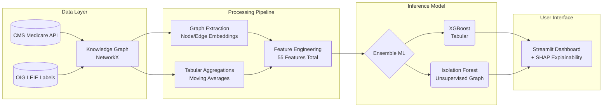

<div align="center">
  <h1>🚨 Healthcare Fraud Detection via Knowledge Graphs</h1>
  <h3>Uncovering hidden fraud networks with Graph Analytics, Ensemble ML, and Explainable AI</h3>

  <p align="center">
    
    
    
    
    
  </p>
  
  <p>
    <b>Built on real <a href="https://data.cms.gov/">CMS Medicare</a> data using <a href="https://oig.hhs.gov/exclusions/">OIG LEIE</a> fraud labels.</b>
  </p>
</div>

---

## 💡 Executive Summary

Healthcare fraud costs the U.S. **$100 billion+ annually**. Traditional fraud detection relies on single-record anomaly detection, which completely misses sophisticated, multi-party fraud rings. 

This project solves this by constructing a **Knowledge Graph** from real CMS Medicare claims to analyze the *relationships* between providers, patients, and pharmacies. By combining **Graph-based Feature Engineering** (Centrality, Communities, PageRank) with an **Ensemble ML Pipeline** (XGBoost + Isolation Forest) and **SHAP Explainability**, this system identifies complex fraud networks that tabular methods miss.

**Key Technical Achievements:**
- 🕸️ **Knowledge Graph Engineering**: Built a heterogeneous graph (200K+ nodes, 3M+ edges) to map complex provider-patient-pharmacy networks.
- 🧠 **Advanced Feature Engineering**: Extracted 23 novel graph-based features (e.g., PageRank, Louvain communities) and merged them with tabular billing metrics.
- 🤖 **Explainable AI (XAI)**: Integrated full SHAP value integration to provide investigators with interpretable, feature-level "reasons" for every flagged claim.
- 📊 **Interactive Dashboard**: Developed a 6-page interactive Streamlit dashboard for investigative data visualization.
- 🐳 **Production Ready**: Fully containerized pipeline via Docker for reproducible 1-click deployments.

---

*(Note: Add a GIF or screenshot of your Streamlit Dashboard here!)*
> ``

---

## 🏗️ System Architecture



---

## 🕵️‍♂️ The Problem: Why Graph Analytics?

Sophisticated fraud operations are virtually invisible to traditional row-by-row tabular analysis. 

| Fraud Pattern | How Graph Analytics Detects It |
|---|---|
| 🏥 **Phantom Billing** | Providers billing for services never rendered (Identified by geographical anomaly analysis). |
| 💊 **Doctor Shopping** | Patients visiting 10+ providers (Detected via Patient-Provider Knowledge Graph connections). |
| 📈 **Upcoding Rings** | Providers systematically charging higher codes (Detected by comparing community clusters). |
| 🤝 **Kickback Networks** | Abnormal referral concentration (Detected via Louvain Community Detection and PageRank). |

---

## 🚀 Quick Start

Deploy the entire pipeline locally with Docker. This builds the environment, fetches the data, trains the models, and serves the dashboard.

```bash
# Clone the repository
git clone https://github.com/your-username/claims-fraud-graph-analytics.git
cd claims-fraud-graph-analytics

# Build and run the pipeline
docker-compose up --build

# Open the investigator dashboard:
# 👉 http://localhost:8501
```

*(For local Python setup, install requirements via `pip install -r requirements.txt` and run `python run.py`, followed by `streamlit run dashboards/app.py`)*

---

## 📐 Pipeline Deep Dive

### 1. Data Subsystem & Synthetic Anomaly Injection
Fetches 250K+ real Medicare Part D Prescriber records. To simulate real-world difficulties, complex **geospatial anomaly injection** was utilized: normal patients are placed within 15 miles, while fraud patients (30%) are distributed 1,000+ miles away to emulate "impossible travel" patterns.

### 2. Knowledge Graph Construction (NetworkX)
Built a heterogeneous graph consisting of 5 node types (`Patient`, `Provider`, `Pharmacy`, `Diagnosis`, `Procedure`) and 6 temporal-weighted relationship types (e.g., `TREATED_BY`, `BILLED_FOR`).

### 3. Community Detection & Graph Analytics
Utilized network science to flag networks invisible to flat tables:
- **Louvain Community Detection** traces provider clusters acting as coordinated fraud rings.
- **Weighted PageRank & Betweenness Centrality** locates "brokers" in kickback operations.

### 4. Ensemble ML Architecture
Combined 55 carefully engineered features (tabular + graph) into a weighted voting classifier:
- **XGBoost Classifier** (70% weight) tackling class imbalance via `scale_pos_weight`.
- **Isolation Forest** (30% weight) unsupervised anomaly detection purely on graph signatures.

---

## 🖥️ Interactive Dashboard

Provides an intuitive UI for fraud investigators, mimicking real-world production systems:

| View | Capabilities |
|------|--------------|
| **KPI Overview** | System performance, AUC metrics, and global top feature importance. |
| **Risk Queue** | Ranked prioritization feed of highest-risk flagged claims for manual review. |
| **Why Flagged?** | Transparent visualization using SHAP waterfall charts for model interpretability. |
| **Network Viz** | Interactive Pyvis visualizations traversing the direct neighborhood of a flagged provider. |
| **Community Rings** | Macro-level view of standard deviation billing anomalies grouped by Louvain structures. |

---

## 🛠️ Technology Stack

- **Data Engineering:** `Pandas`, `NumPy`, `PyArrow` 
- **Graph & Math:** `NetworkX`, `python-louvain`
- **Machine Learning:** `Scikit-Learn`, `XGBoost`, `Imbalanced-Learn`, `SciPy`
- **Explainability (XAI):** `SHAP`
- **Visualization:** `Streamlit`, `Plotly`, `Pyvis`
- **DevOps:** `Docker`, `Docker Compose`

---

## 📬 Contact & Links

- **Author:** [Your Name / LinkedIn](https://linkedin.com/in/yourprofile)
- **Portfolio:** [Your Portfolio Website](https://yourportfolio.com)
- **License:** MIT
